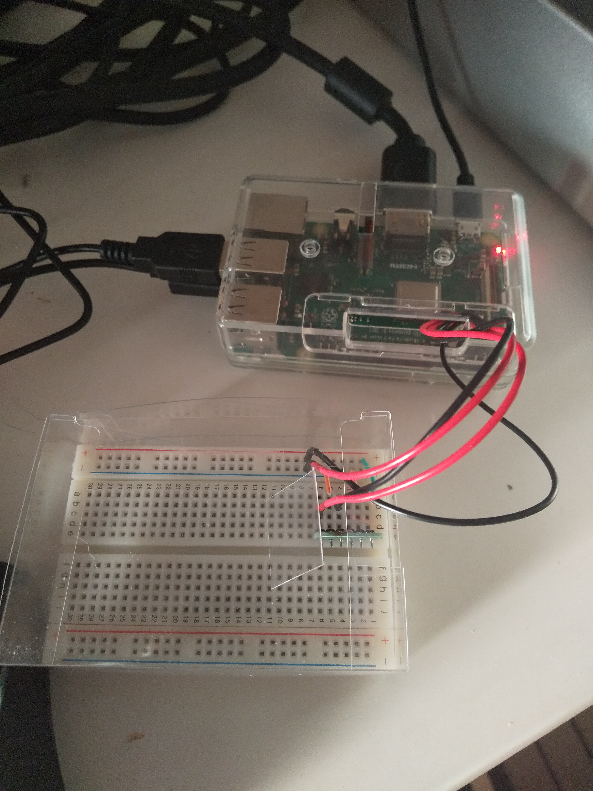

# Raspberry Pi with Consul

Demo to install consul on Raspberry Pi. This demo will:
- Create consul cluster with Raspberry PI.
- Read sensor data (Temprature/Pressure/Humidity) and write them to Consul K/V
- Install DataDog agent to monitor metrics.

## Hardware used in this demo

- Raspberry PI
  - [Raspberry PI 3 model B](https://www.raspberrypi.org/products/raspberry-pi-3-model-b/)
- Sensor
  - [BME280](https://www.bosch-sensortec.com/products/environmental-sensors/humidity-sensors-bme280/)



## Hardware set up

### Raspberry PI
  - OS install
    - Steps
        - https://www.raspberrypi.org/documentation/installation/installing-images/
    - OS images
        - https://www.raspberrypi.org/downloads/raspbian/

  - Network
    - Wifi
      - Make sure Raspberry PI is on a network reachable to Consul server.

### Sensor
  - Attach to Raspberry PI
      - [How to set up sensor](https://www.deviceplus.com/how-tos/raspberrypi-guide/reading-temperature-humidity-and-pressure-with-ae-bme280-and-raspberry-pi/)

## Software set up
### On Raspberry PI
  - Clone this repository
    - `git clone https://github.com/masatomo-ito2/raspberry_pi_consul.git`
  - Run [1.install_software.sh](./scripts_client/1.install_software.sh)
  - Systemd
```shell
sudo cat <<EOF> /etc/systemd/system/consul.service
[Unit]
Description="HashiCorp Consul - A service mesh solution"
Documentation=https://www.consul.io/
Requires=network-online.target
After=network-online.target
ConditionFileNotEmpty=/home/pi/config.json

[Service]
Type=notify
User=pi
Group=pi
ExecStart=/usr/local/bin/consul agent -join 192.168.0.150 -data-dir=/home/pi/data_dir -config-file=/home/pi/config.json
ExecReload=/usr/local/bin/consul reload
KillMode=process
Restart=on-failure
LimitNOFILE=65536

[Install]
WantedBy=multi-user.target
EOF
```


### On host that runs Consul server
  - Clone this repository
    - `git clone https://github.com/masatomo-ito2/raspberry_pi_consul.git`


## Set up Consul cluster
1. Start consul server **on host machine**
  - Run [1.start_server.sh](./scripts_server/1.start_server.sh)
2. Start consul client **on Raspberry PI**
```shell
sudo systemctl enable consul
sudo systemctl start consul
```


## Read the sensor data

- You can read the raw sensor data with [I2C communication protocol](https://en.wikipedia.org/wiki/I%C2%B2C):
  - `sudo i2cdump -y 1 0x76`
- Python script to convert raw sensor data to human readable and write to Consul K/V.
  - [bme280_sample.py](./scripts_client/bme280_sample.py)
  - `python bme280_sample.py`
- Use `consul exec` to get/update data from host.
  - ```consul exec -node=raspberrypi python /home/pi/raspberry_pi_consul/scripts_client/bme280_sample.py```


### Get the data in K/V

The sensor data are stored in Consul K/V. You can read them via:
```shell
consul kv get pi/temp
consul kv get pi/pres
consul kv get pi/hum
```

You can also watch the K/V with `watch` command for any change.
```shell
consul watch -type=key -key=pi/temp "jq -r .Value | base64 -D && echo"
```

Or From UI:


## Datadog setting

Installation
```console
DD_API_KEY=xxxxxxxxxxxxxxxx sh -c "$(curl -L https://raw.githubusercontent.com/DataDog/dd-agent/master/packaging/datadog-agent/source/setup_agent.sh)"
```

To run, dogstatsd:
```shell
nohup sh /home/pi/.datadog-agent/bin/agent &
```

You will get metrics monitored on Datadog dashboard.


## Send sensor data to DataDog

You can send custom data to datadog using [python library](https://github.com/DataDog/datadogpy).
- [https://docs.datadoghq.com/developers/metrics/dogstatsd_metrics_submission/?tab=python](https://docs.datadoghq.com/developers/metrics/dogstatsd_metrics_submission/?tab=python)

- This willl send custom metrics to datadog agent running locally. Then Agent aggregate them to Datadog server.

- Please see/run [script](scripts_client/bme280_datadog.py).
  - ```nohup python scripts_client/bme280_datadog.py &```

Now you can see the data coming from a sensor in Datadog dashboard.


## Future TODO  
- [____] Set up datadog dashboard by Terrarorm.
